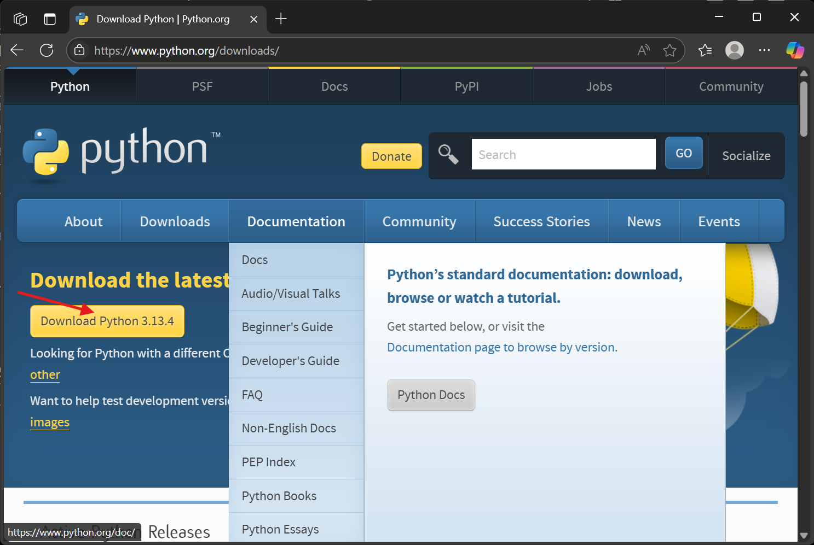

# 📝 Spelling Analyzer

Spelling Analyzer is a Python tool designed to scan your codebase or project files to identify spelling mistakes and potential typos in comments and strings. It helps developers maintain cleaner, more professional code by automating the detection of spelling errors.

Featuring both a Python API and a convenient command-line interface (CLI), Spelling Analyzer integrates easily into your development workflow, making code reviews and quality assurance more efficient. Whether you're working solo or as part of a team, this tool assists in delivering polished code with improved readability.

---

## 📚 Table of Contents

1. [Project Features](#-project-features)  
2. [Project Structure](#-project-structure)  
3. [Prerequisites](#-prerequisites)  
   - [Install Python](#-install-python)  
4. [Create Python Package](#-create-python-package)  
   - [Create `setup.cfg`](#1-create-setupcfg)  
   - [Create Minimal `setup.py`](#2-create-minimal-setuppy)  
   - [Add a LICENSE](#3-add-a-license-mit-example)  
   - [Install Packages](#4-install-packages)  
   - [Build the Package](#5-build-the-package)  
5. [Package Installation Options](#-package-installation-options)  
   - [Option 1: Local Development Install](#-option-1-local-development-install)  
   - [Option 2: Publish and Share the Package](#-option-2-publish-and-share-the-package)  
   - [Option 3: Publish to GitHub (Alternative to PyPI)](#-option-3-publish-to-github-alternative-to-pypi)  
6. [Usage](#-usage)  
   - [Python API](#-python-api)  
   - [Command-Line Interface (CLI)](#-command-line-interface-cli)  
7. [Troubleshooting](#-troubleshooting)  
8. [Testing](#-testing)  

--

## ✅ Project Features

1. **Multi-language Support**  
   Analyzes source code files in multiple programming languages: Python (`.py`), C# (`.cs`), Visual Basic (`.vb`), JavaScript (`.js`), and TypeScript (`.ts`).

2. **Spellchecking in Code and Comments**  
   Detects spelling errors both in code string literals and comments, improving overall code quality and documentation.

3. **File and Project-Level Analysis**  
   Supports analyzing individual files or entire project directories recursively.

4. **Robust Error Handling and Logging**  
   Handles missing files, unsupported formats, and tool failures gracefully, logging errors for easier debugging and traceability.

5. **Extensible Architecture**  
   Modular design allows integration of additional analysis tools beyond spellchecking, making it easy to extend functionality.

6. **Command-Line Interface (CLI)**  
   Offers a CLI entry point for easy usage in development workflows or CI/CD pipelines.

7. **Detailed Issue Reporting**  
   Reports detected spelling issues with file name, line number, misspelled word, suggested correction, and source (comment or code).

8. **Unit Tested**  
   Comprehensive test coverage ensures reliability and easier maintenance.

9. **Configurable Logging**  
   Centralized logger configuration for consistent and adjustable logging across modules.

---

## 📁 Project Structure

```plaintext
spelling_analyzer/
│
├── src/
│   ├── CodeAnalyzer/
│   │   ├── cli.py                      # Command-line interface to run the analyzer tools
│   │   └── analyzer.py                 # Core analyzer logic: scans files, runs checks, gathers results
│   │
│   ├── CodeReview/
│   │   └── pyspellchecker_runner.py    # Integration with pyspellchecker to detect spelling errors in code/comments
│   │
│   └── logger_config.py                # Centralized logging configuration for consistent logging across modules
│
├── tests/
│   ├── test_analyzer.py                # Unit tests covering analyzer.py functionality
│   └── test_pyspellchecker_runner.py   # Unit tests for pyspellchecker_runner.py spellchecking behavior
│
├── requirements.txt                    # Production dependencies needed to run the project (e.g., spellchecker)
├── requirements-dev.txt                # Development dependencies (e.g., testing frameworks)
├── setup.cfg                           # Optional configuration file for setup tools or other tools (e.g., flake8, pytest)
├── setup.py                            # Python packaging and installation script for the project
├── LICENSE                             # License file specifying terms for usage and distribution
└── README.md                           # Project overview, installation instructions, usage examples, etc.
```

## 📋 Prerequisites

## 🐍 Install Python

1. **Download Installer**:

    - Visit [Python Download](https://www.python.org/downloads/) and click **Download for Windows** to get `python-3.13.4-amd64.exe`.

    

2. **Run the Installer**:

    - Execute `python-3.13.5-amd64.exe` and follow the installation prompts.

        
        
        

3. **Verify Installation**:
   
    - Open PowerShell and run the command

        ```powershell
        python --version
        ```

        
        
    - Check pip installation

        ```powershell
        pip --version
        ```

        

    - Upgrade pip if required

        ```powershell
        python -m pip install --upgrade pip
        ```

---

## 📦 Create Python Package

### 1️⃣ Create `setup.cfg`

```ini
[metadata]
name = spelling_analyzer
version = 1.0.0
author = Ahmad Awsaf uz zaman
author_email = engzaman2020@gmail.com
description = A spelling analyzer tool.
long_description = file: README.md
long_description_content_type = text/markdown
url = https://github.com/ahmad-act/spelling_analyzer
license = MIT
classifiers =
    Programming Language :: Python :: 3
    License :: OSI Approved :: MIT License
    Operating System :: OS Independent

[options]
packages = find:
python_requires = >=3.13

[options.entry_points]
console_scripts =
    spelling-analyzer = src.CodeAnalyzer.cli:main
```

### 2️⃣ Create Minimal `setup.py`

```python
from setuptools import setup

setup()
```

### 3️⃣ Add a LICENSE (MIT Example)

```text
MIT License

Copyright (c) 2025 Ahmad Awsaf uz zaman

Permission is hereby granted, free of charge, to any person obtaining a copy  
of this software and associated documentation files (the "Software"), to deal  
in the Software without restriction, including without limitation the rights  
to use, copy, modify, merge, publish, distribute, sublicense, and/or sell  
copies of the Software, and to permit persons to whom the Software is  
furnished to do so, subject to the following conditions:

The above copyright notice and this permission notice shall be included in all  
copies or substantial portions of the Software.

THE SOFTWARE IS PROVIDED "AS IS", WITHOUT WARRANTY OF ANY KIND, EXPRESS OR  
IMPLIED, INCLUDING BUT NOT LIMITED TO THE WARRANTIES OF MERCHANTABILITY,  
FITNESS FOR A PARTICULAR PURPOSE AND NONINFRINGEMENT. IN NO EVENT SHALL THE  
AUTHORS OR COPYRIGHT HOLDERS BE LIABLE FOR ANY CLAIM, DAMAGES OR OTHER  
LIABILITY, WHETHER IN AN ACTION OF CONTRACT, TORT OR OTHERWISE, ARISING FROM,  
OUT OF OR IN CONNECTION WITH THE SOFTWARE OR THE USE OR OTHER DEALINGS IN THE  
SOFTWARE.
```

### 4️⃣ Install Packages

1. For developenet and production:

    ```bash
    pip install -r requirements.txt
    ```

    - requirements.txt

        ```plaintext
        pyspellchecker
        ```

2. For developenet:

    ```bash
    pip install -r requirements-dev.txt
    ```

    - requirements-dev.txt

        ```plaintext
        coverage
        pytest
        ```

### 5️⃣ Build the Package

```bash
pip install build
python -m build
```

This generates distribution files in the `dist/` folder.

---

## 📦 Package Installation Options

### ✅ Option 1: Local Development Install

Install the project locally (editable install):

```bash
pip install -e .
```

Then you can use in other projects (within the same environment):

```python
from code_analyzer import analyze_project
```

---

### ✅ Option 2: Publish and Share the Package

#### 📤 Publish to PyPI

1. **Register on PyPI:**

    Go to: https://pypi.org/account/register  

2. **Install Twine:**

    ```bash
    pip install twine
    ```

3. **Upload to PyPI:**

    ```bash
    twine upload dist/*
    ```

    You'll be prompted for your PyPI credentials.

4. **Optional: Test Upload to TestPyPI**

    ```bash
    twine upload --repository testpypi dist/*
    ```

    Then install it with:

    ```bash
    pip install -i https://test.pypi.org/project/spelling-analyzer
    ```

### ✅ Option 3: Publish to GitHub (Alternative to PyPI)

1. **Push your code to a GitHub repo.**

2. **Install from GitHub in another project:**

    ```bash
    pip install git+https://github.com/ahmad-act/spelling_analyzer.git
    ```

---

## 🚀 Usage

### 🐍 Python API

Import and use the analyzer in your own Python project:

```python
from spelling_analyzer import analyze_project

report = analyze_project('/path/to/project')
print(report)
```

### 💻 Command-Line Interface (CLI)

Run the analysis from your terminal:

```bash
spelling-analyzer "<path/to/project>" --output "<path/to/output/report.json>"
```

Example:

```bash
spelling-analyzer "D:\My Study\Coding\code_analyzer_v2\TestProject" --output "D:\My Study\Coding\code_analyzer_v2\report.json"
```

---

## 🐞 Troubleshooting 

### 🔍 Check Installed Packages

To check what's installed:

```bash
pip list
```

Look for `spelling-analyzer`. Editable installs point to your local directory.

### ❌ Uninstall the Package

```bash
pip uninstall spelling-analyzer
```

### 🗑️ Uninstall all Packages

```bash
pip freeze > unins ; pip uninstall -y -r unins ; del unins
```

---

## 📄 Testing

1. **✅ Run all tests:**

    ```bash
    python -m unittest discover -s tests
    ```

2. **🧪 Run tests with coverage:**

    ```bash
    coverage run -m unittest discover -s tests
    ```

3. **📊 Generate a Coverage Report (Terminal):**

    ```bash
    coverage report -m
    ```

    Sample output:

    ```plaintext
    PS D:\My Study\Coding\spelling_analyzer> coverage report -m
    Name                                      Stmts   Miss  Cover   Missing
    -----------------------------------------------------------------------
    src\CodeAnalyzer\__init__.py                  2      0   100%
    src\CodeAnalyzer\analyzer.py                 35      3    91%   53-55
    src\CodeReview\__init__.py                    0      0   100%
    src\CodeReview\pyspellchecker_runner.py      43      3    93%   71-73
    src\__init__.py                               0      0   100%
    src\logger_config.py                          6      1    83%   16
    tests\test_analyzer.py                       63      1    98%   83
    tests\test_pyspellchecker_runner.py          70      1    99%   103
    -----------------------------------------------------------------------
    TOTAL                                       219      9    96%
    ```

4. **🌐 Generate an HTML Report (Optional):**

    ```bash
    coverage html
    ```

    - Open **htmlcov/index.html** in your browser to see detailed coverage.

5. **🧹 Clean Up Coverage Files (Optional):**

    ```bash
    coverage erase
    ```

6. **🔁 Run tests with pytest:**

    ```bash
    pytest tests
    ```

---

